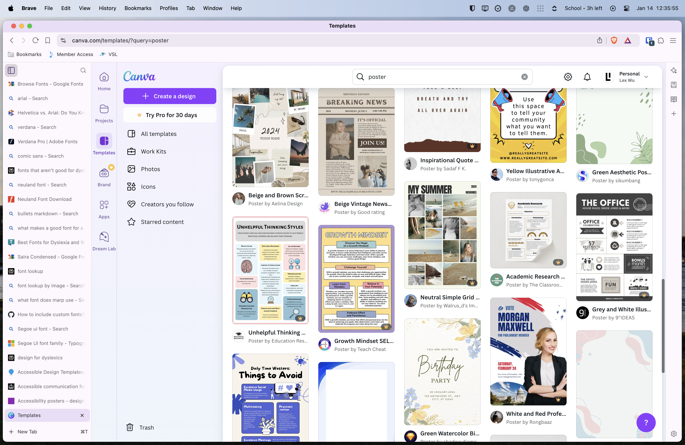

<!-- paginate: skip -->

# Dyslexia
A small little presentation by Lex Wu
[lexwu.com](https://lexwu.com) | @lwu877

<!-- _footer: "You might find a little tidbit or fun in the footer that I won't mention out loud - please just let me present in peace" -->

---
<!-- paginate: true -->

# Some Basic Symptoms
- Spelling
- Reading (at least, at speed)
- Writing
- Pronunciation
- Understanding what I just read

<!-- _footer: "Do you like the pretty colours? Most of the backgrounds (besides that one photo at the beginning) are from Unsplash. First photo taken by me :)" -->

---
<!-- _paginate: skip -->
<!-- _color: white -->

# "Fun Facts"
Well, as fun as one can get wth psychological disorders
<!-- _footer: '"none of these facts are fun" yeah, thats the point' -->

---
<!-- _color: white -->

# 30% of people with ADHD also have dyslexia.

- Yes, that's a lot.
- People with ADHD are 6 times more likely to have something like dyslexia

<!-- _footer: "No snarky comment here" -->

---

<!-- _color: white -->
# "Stuff"
So, what do dyslexic people deal with?

---
<!-- _footer: "For Lex's reference, it's the water-based tubing that they use to actuate stuff in robotics. This image By Esther Bubley is in the public domain and available from Wikimedia Commons." -->

# Phonics
- How do you spell this?
- Now, how would you figure it out?
- If you couldn't sound it out, would it be hard?
- And if you can't sound it out, how do you pronounce it?
- I think you get the point

---

# Reading

Simple word, right?

- rǝɐdiug (some letters upside down)
- gnidaer (backwards)
- redanig (some letters mixed up)
- plenty of other things

---
<!-- _backgroundColor: #E2074F -->
<!-- _color: white -->
# Solutions?
(Yes, we could go more into learning, but I like fonts)

---

<!-- _footer: "*As of now, there are currently no studies on Lexend's efficiency - just lots of testimonials." -->

# Fonts
Reading is hard. Fonts can help.
- [Lexend](https://www.oneclub.org/awards/adcawards/-award/43158/lets-end-dyslexia-through-lexend/) - probably legible*
- Dyslexie and OpenDyslexic fonts exist, but have middling results
- Google Fonts - [variable width](https://www.lexend.com/#download)
- [Arial](https://creativepro.com/helvetica-vs-arial-difference/) (derivative of Helvetica), [Helvetica](https://www.monotype.com/fonts/helvetica-now), [Verdana](https://fonts.adobe.com/fonts/verdana-pro), and Comic Sans also help with legibility

---

# Commonalities?
- Sans-serif - Times New Roman's ligatures can trip people up
- Ligeratures - notice how a lowercase b and d are significantly different?

---
<!-- _footer: "Yes, I'm targeting everyone making posters with Canva. If you need to rely on a template, you shouldn't be making posters" -->

## So, you want to make your project accessible. 
- [Lobster](https://fonts.google.com/specimen/Lobster), [Neuland](https://fontmeme.com/fonts/neuland-font/), and others are no-gos
- Stick to the sans-serifs.
- [Monospaces are great, too](https://fonts.google.com/specimen/Roboto+Mono)
- _Italics suck to work with_
- [So do condensed fonts](https://fonts.google.com/specimen/Saira+Condensed)
- When in doubt, choose the boring font (like in this presentation)

---

<!-- _footer: "This isn't a joke I swear - y'all suck at designing posters" -->

# Ooo pretty colors
Designing posters for dyslexia and other disorders is hard.
- [SoloPress case](https://www.solopress.com/blog/print-inspiration/designing-for-accessibility-how-we-created-expert-approved-templates/)
- [UK Government - accessible communications](https://www.gov.uk/government/publications/inclusive-communication/accessible-communication-formats#accessible-print-publications)

---

# Learning stuff
Yeah, this is a comprehensive slideshow

- Going over [the basics of spelling](https://www.bdadyslexia.org.uk/advice/children/how-can-i-support-my-child/spelling)
- Audiobooks instead of reading - because words jumping off the page don't really help

---

<!-- _footer: 'Lex is probably making something up something on the spot' -->
---
<!-- _color: white -->

# Summary
- Dyslexia affects reading, writing, speaking, and how they interpret and produce* their language.
- As with everything, what works for one doesn't work for all
- Being able to customize experiences makes everything better
- People read differently and that's okay

<!-- _footer: '*it was the best wording I could come up with. sorry.' -->

---

<!-- _backgroundColor: black 
_paginate: skip
_color: white 
_footer: '[works cited](https://github.com/lwu877/school-presentations/blob/final/2023-24/MicroEcon/ProgressiveTaxWC.md)' -->

# Thanks for your time. 
Tomatoes may now be thrown.
© 2025 lex wu / all rights reserved